# 前言

对于热爱开源热爱计算机的小伙伴们来说，Markdown这种文本格式并不陌生。正如您见到的这样，本文就是使用markdown书写的。Markdown 是一种轻量级标记语言，它允许人们使用易读易写的纯文本格式编写文档。如果您对Markdown语法还不熟悉的话，可以参考一些教学[博客](https://www.runoob.com/markdown/md-title.html)。

本文旨在解决开源工作的场景：

- 多个小伙伴独立写好各章节Markdown文本
- 组织者将各分章节汇总成一本书
- 将书生成一个pdf版本以供传播
- 将md文本转成html版本
- 等等

Markdown在书写文章时为我们带来许多方便，这里分享一种简单的markdown风格pdf制作方法，这种方法已成功应用在Datawhale几期开源教程里。效果如下：

<center>
  <div>
	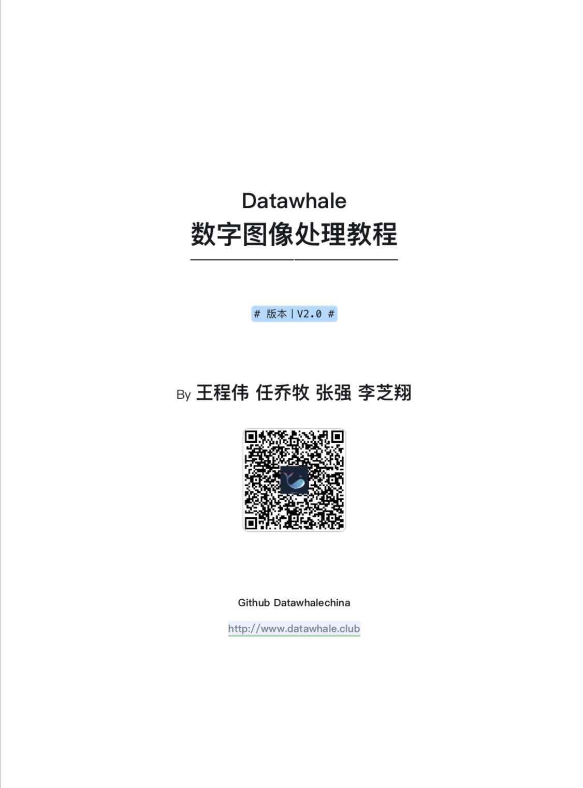
 	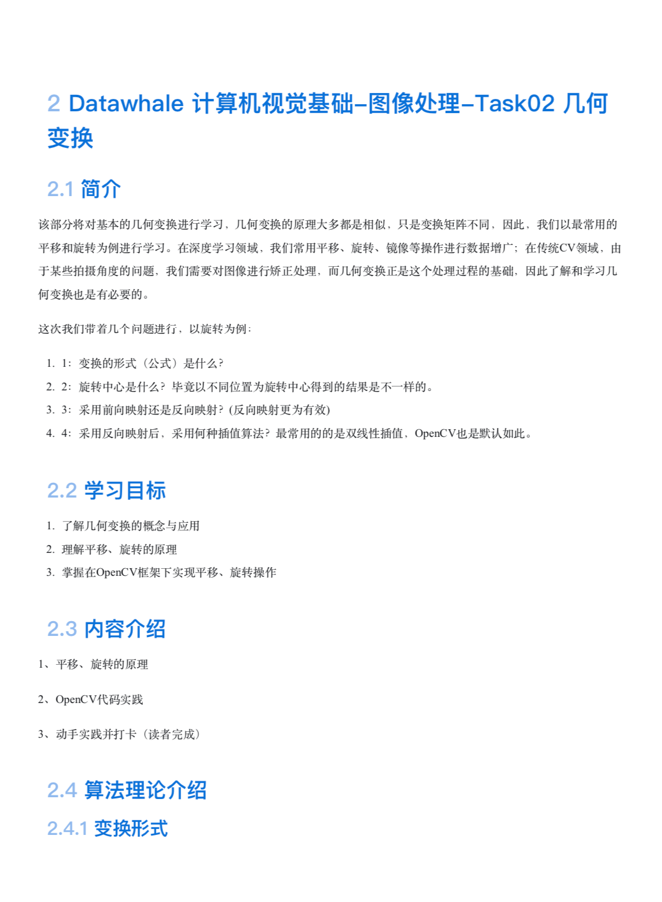
  </div>
  <div>
    左：封面效果，右：内容效果
  </div>
</center>
是不是简约且美观？

读完本文，你将会了解到：

- Typora和VLook等工具的安装和配置好
- 将各独立章节合并成一本书的方法
- Markdown协作中要遵守的规范

# 工具

> 工欲善其事必先利其器

## Typora

### 介绍

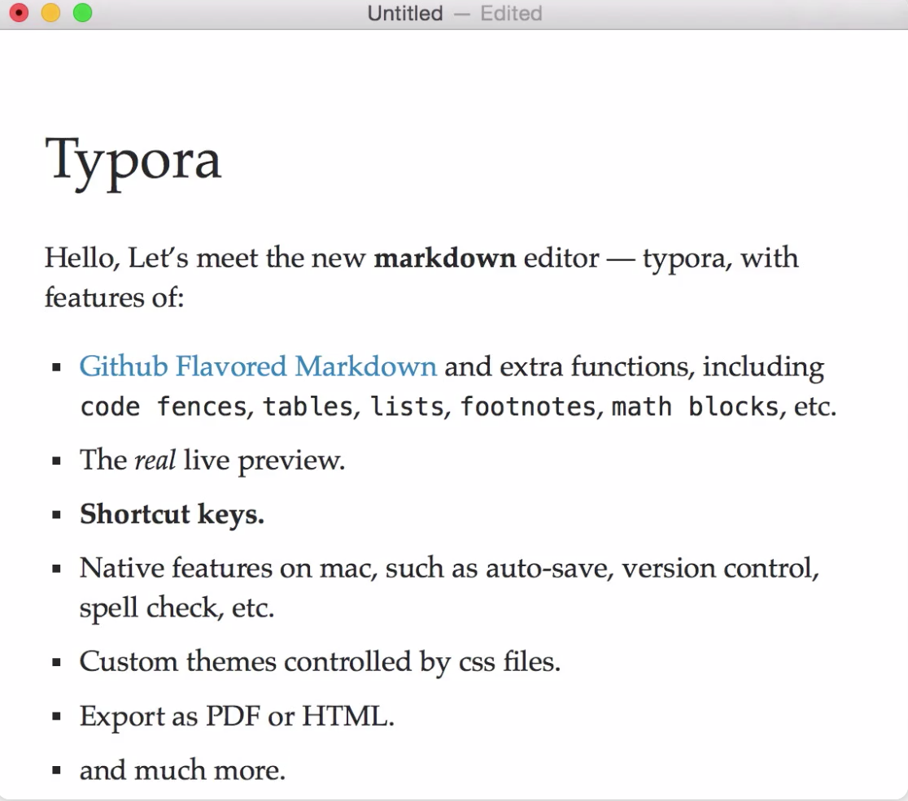

Typora是一个优雅的Markdown编辑器。Typora 支持 MacOS 、Windows、Linux 平台，且包含多种主题，编辑后直接渲染出效果。支持导出HTML、PDF、Word、图片等多种类型文件。Typora 官网：https://typora.io/。

我们推荐使用这款软件，它目前是免费的。

### 设置

#### 图片路径设置

下载安装好软件后，就可以开始使用了。但Typora默认将图片存在项目之外的一个路径。我们希望图片以相对路径存储，并且都存在名为"assets"的文件夹下。使用： <kbd>偏好设置</kbd> --> <kbd>图像</kbd>--><kbd>复制到指定路径</kbd>

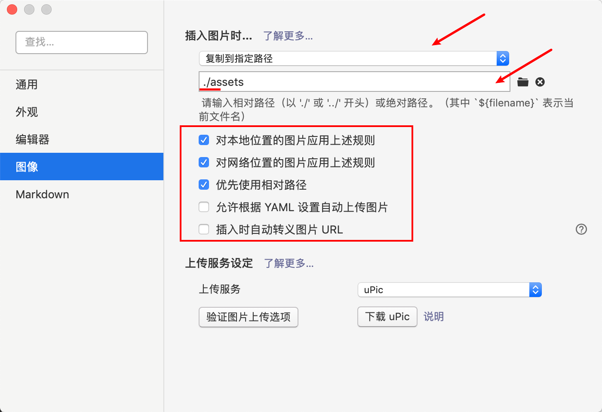

这样图片就能存在当前文件的目录下了，我们可以直接将图片拖进typora，或者复制粘贴，与该项目有关的图片可以直接存在当前相对路径下了，是不是很方便？

> Typora也可以使用图床，笔者觉得图床在写博客的场景里更适用，在github开源项目建议直接使用图像文件。

#### 开启 <kbd>Markdown</kbd> --> <kbd>Markdown 扩展语法</kbd>下的所有选项

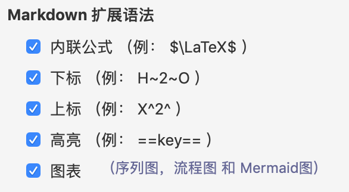

#### 开启 <kbd>代码块</kbd> <kbd>公式</kbd>下的所有选项

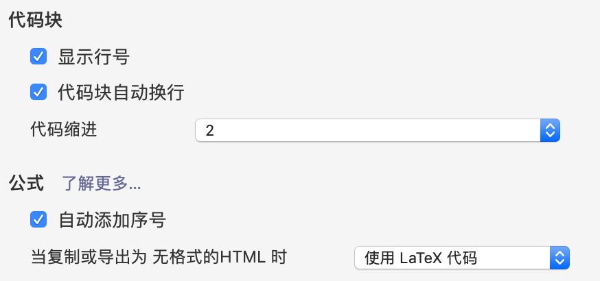

## VLook

### 介绍

VLook是一款Typora插件工具，提供了一系列美观的Markdown主题。这个系列的主题除了为Markdown不同标签设计风格，让Markdown不再那么单调：

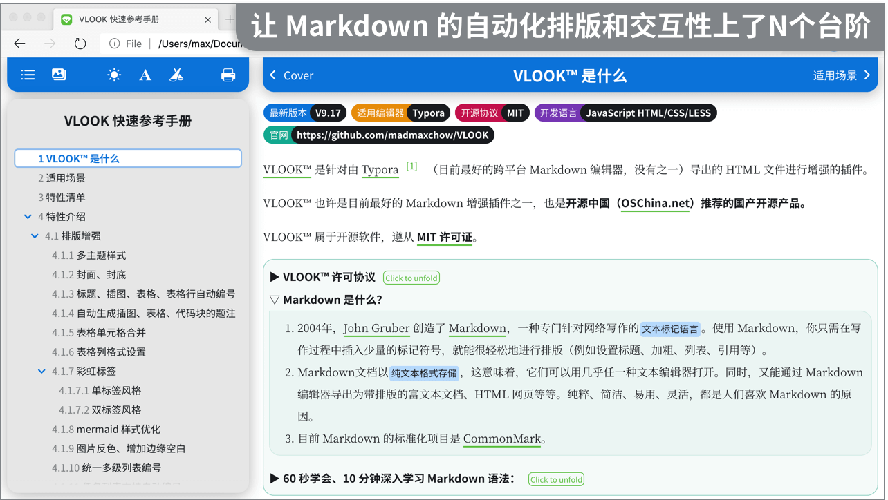

还解决了Markdown的一些痛点，比如

- 封面制作
- 标题自动标号

笔者曾尝试过进行一些折腾，完成上面两个功能，但这套主题做的非常优秀，我们直接用它就ok。

- [开源中国（备用）](https://gitee.com/madmaxchow/VLOOK)

- [Github （主站）](https://github.com/MadMaxChow/VLOOK)

### 安装

- 下载VLook

使用release版

```
访问官方主页下载最新发布版本：https://github.com/MadMaxChow/VLOOK/releases
```

或者直接克隆原仓库

```bash
git clone https://github.com/MadMaxChow/VLOOK --depth 1
```

#### 应用主题

- 将`released\theme`下所有CSS文件复制至 Typora 的主题目录（ Typora「偏好设置」中点击「外观 - 打开主题目录」定位到该目录）；

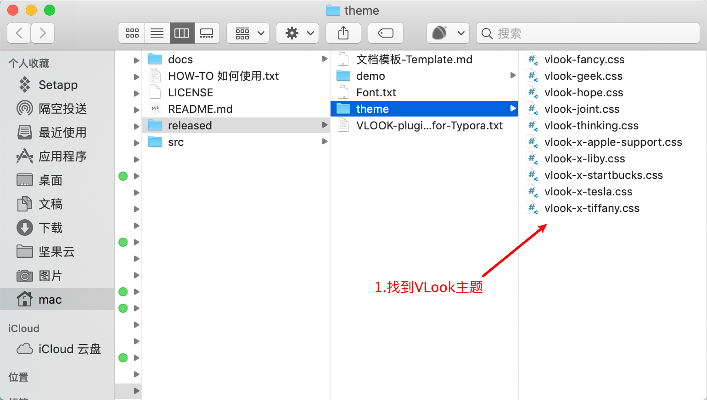

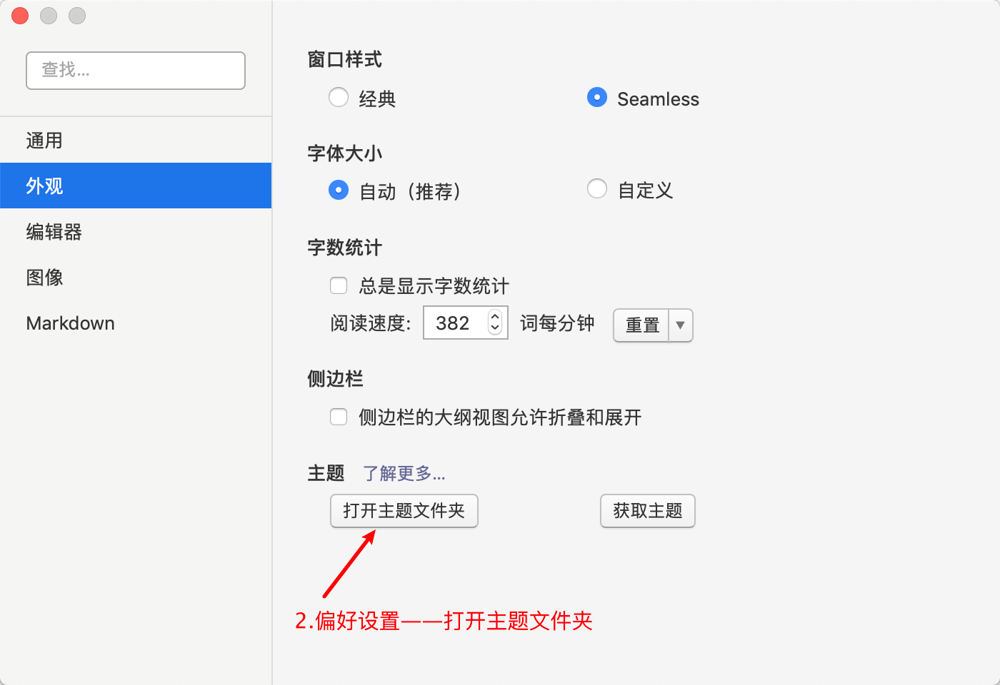

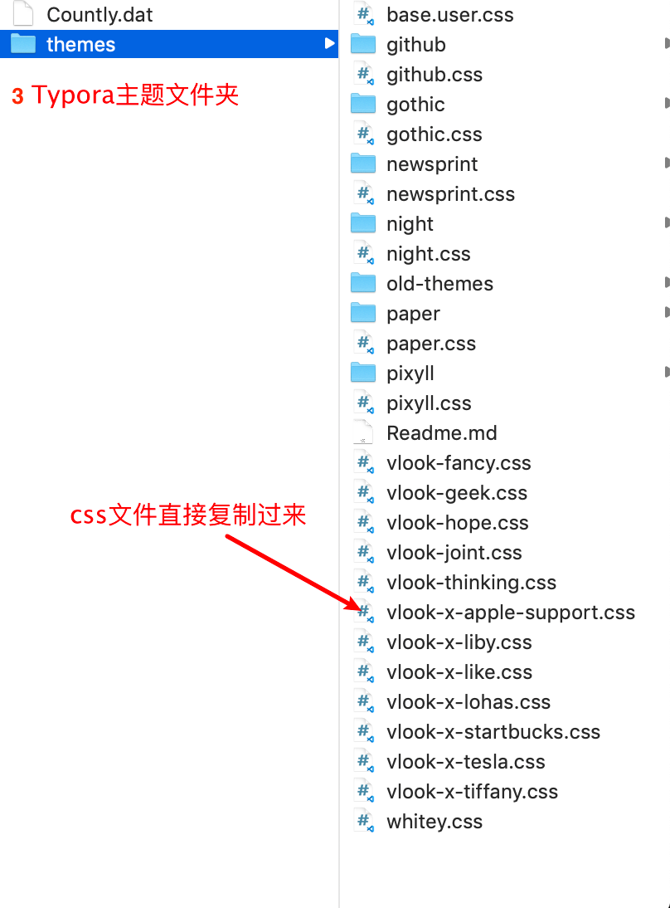

- 重启 Typora ，点击菜单`主题`，选择以`vlook-*`形式命名的主题，即可启用对应的 VLOOK 主题样式；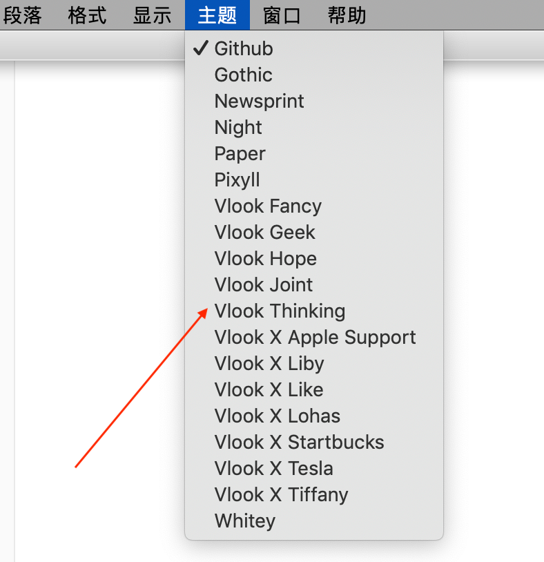

- 可基于`VLOOK\3-demo`下的`*.md` 为模板来创建你自己的文档。

# 工作流程

## 建立协作仓库

两点建议：

- 建议使用github进行协作
- 建议队友们**做好图片使用的约定**，比如将图片放在当前相对路径assets文件下。切记不要使用绝对路径，否则换一台电脑就麻烦了哦！

## 完成每个小章节的编写

一个教程，通常每章节的内容应该相似的，建议提前使用一个章节模板，每人修改模板即可。这里提供一个[模板](./课程资料模板.md)

- 关于标题：每个章节要以一级标题开始，表明这个章节的话题
- 最多不要超过五级标题
- 不需要对标题进行编号，主题会帮我们自动生成

## 各章节合并

各章节内容编辑好之后，可以简单的复制粘贴，合并成一个内容，当然，也可以使用命令或编程实现。比如，在mac/linux下，可以直接使用`cat`命令：

```bash
cat Task0[1-6]* > $BOOKNAME #将Task01到Task06进行合并，$BOOKNAME为汇总名
```

## 添加封面和封底

最前面添加封面的Markdown代码：

```markdown
###### <sup>Datawhale</sup><br>xx教程<br>────────<br><br>`# 版本丨V1.0 #`<br>**贡献者1 贡献者2**<br><br><div align=center></div><br>*Github Datawhalechina*<br>*http://www.datawhale.club*<br>
```

最后面添加封底的Markdown代码：

```markdown
###### The End
```

## 导出pdf

<kbd>文件</kbd> --> <kbd>导出</kbd>--> <kbd>pdf</kbd>

> 关于一级标题另起一页：
>
> 笔者的Typora在导出pdf时可选择这个功能，但是貌似有bug，笔者解决方案是在需要另起一页的地方加入下面markdown代码：
>
> ```bash
> <div STYLE="page-break-after: always;"></div>
> ```
>
> 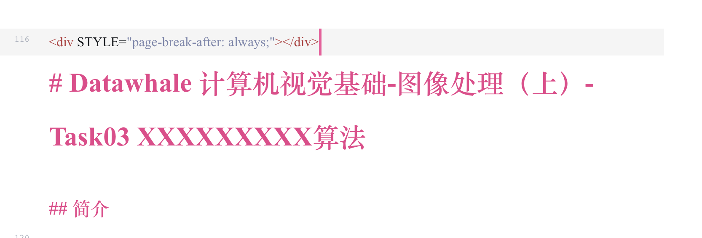


## Markdown导出html（可选）

我们还可以将Markdown文本导出格式丰富的vlook风格页面，看看[效果](https://madmaxchow.github.io/VLOOK/theme-hope.html#)。

使用方法

- <kbd>文件</kbd> --> <kbd>导出</kbd>--> <kbd>html</kbd> 找到导出的html文件

- 打开文件「[released\VLOOK-plugin-for-Typora.txt](https://github.com/MadMaxChow/VLOOK/blob/master/released/VLOOK-plugin-for-Typora.txt)」，全选所有内容，并复制；

  - 用纯文件编辑器，如：记事本、Visual Studio Code (https://code.visualstudio.com/)，打开该导出的 HTML 文件；

  - 搜索「<body 」，并将复制的内容粘贴到body标签的「>」之后，举例：

    ```markdown
    <body ...>
    ← ← ← ← ← 将「VLOOK-plugin-for-Typora.txt」文件的内容粘贴于此！
    　...
    </body>
    ```

  保存，在浏览器打开看看吧~

# 总结

Typora是非常优秀的Markdown编辑工具，而VLook是非常优秀的Markdown主题，让我们专心于文档编辑，而不用考虑太多格式问题。最后提供一个完整的[例子](./template.md)。最后总结下提出的建议&规范：

- 每个章节要以一级标题开始，表明这个章节的话题
- 最多不要超过五级标题
- 不需要对标题进行编号，主题会帮我们自动生成
- 在需要插入目录的地方使用`[TOC]`可以插入目录

